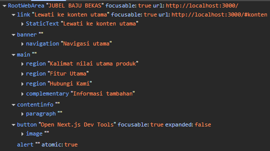
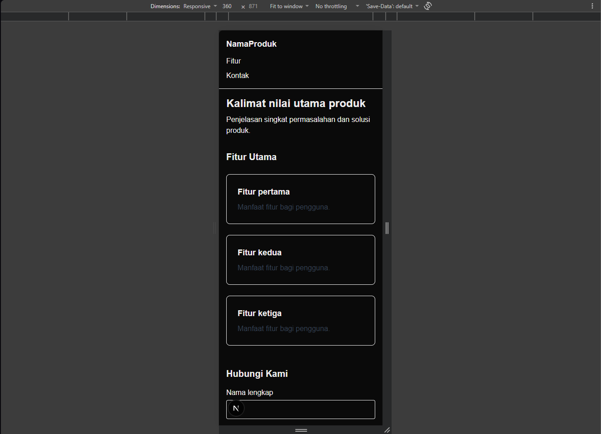
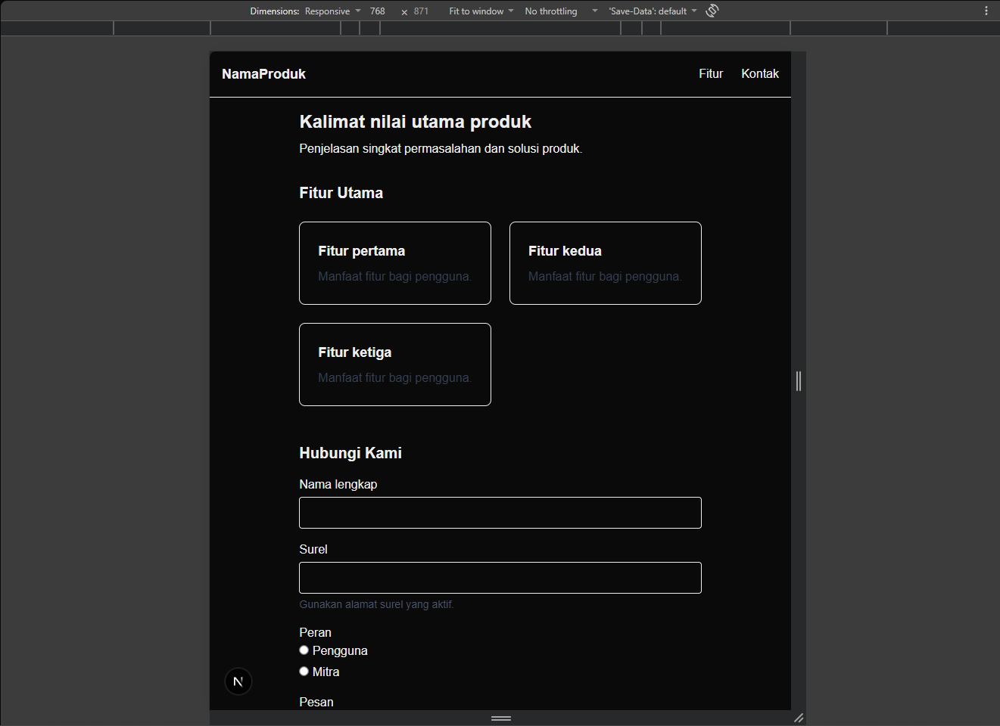
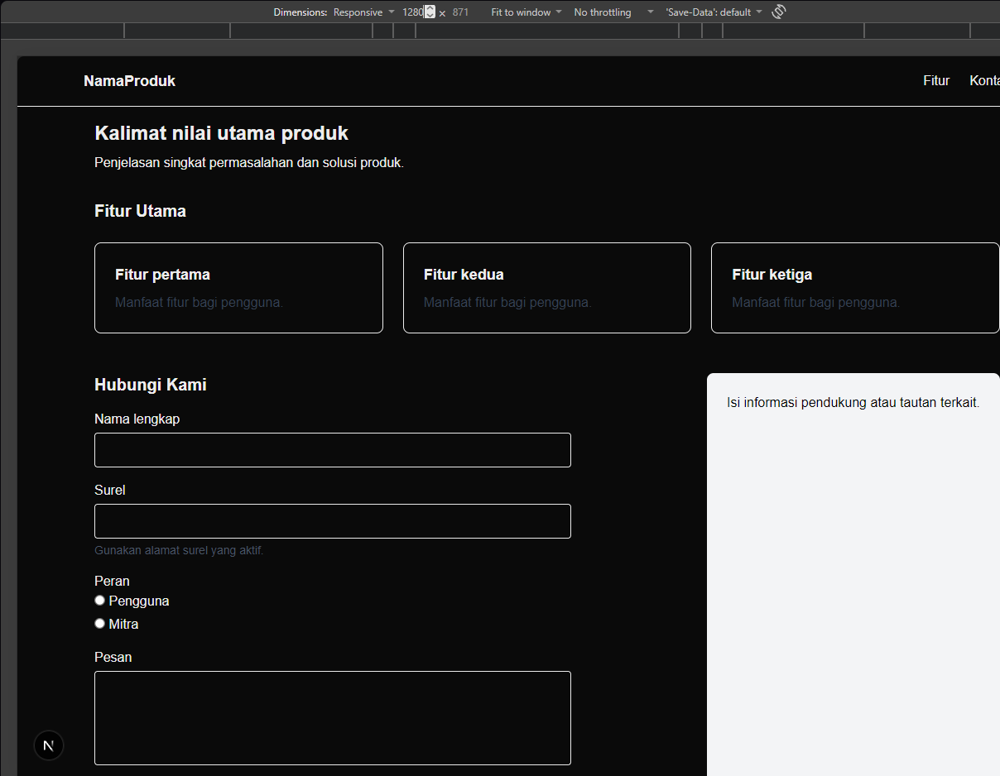

# Dokumen Teknis Modul 2 – HTML Semantik, Tailwind CSS, dan Aksesibilitas

Nama/NIM      : Syauqi / 105224053
Repositori    : (https://github.com/Yookiftw/105224053_PrakPemWeb)

## 1. Struktur Semantik
- **Kerangka landmark dan hierarki judul halaman utama:**
  Halaman utama dibangun menggunakan elemen semantik HTML yang membentuk peran landmark yang jelas:
  - `<header>` berperan sebagai `banner` untuk identitas situs.
  - `<nav>` berperan sebagai `navigation` untuk tautan navigasi.
  - `<main>` berperan sebagai `main` untuk membungkus konten utama.
  - `<section>` yang diberi atribut `aria-labelledby` berperan sebagai `region` (misalnya pada bagian Fitur dan Kontak).
  - `<aside>` berperan sebagai `complementary` untuk informasi pendukung.
  - `<footer>` berperan sebagai `contentinfo` di bagian bawah halaman.
  Hierarki judul tersusun rapi yang dimulai dengan satu elemen `<h1>` untuk judul utama halaman, lalu diikuti dengan elemen `<h2>` untuk judul setiap bagian (section).
- Tangkapan layar pohon aksesibilitas pada DevTools:

  

## 2. Tata Letak Responsif
- Tangkapan layar pada lebar 360 px, 768 px, dan 1280 px:
  
  
  

- **Kelas Flexbox, Grid, dan breakpoint yang digunakan beserta alasannya:**
  - **Navigasi (Flexbox):** 
  Menggunakan pendekatan *mobile-first* dengan kelas `flex flex-col` agar logo dan menu bertumpuk pada layar ponsel. Lalu, ditambahkan breakpoint `sm:flex-row sm:items-center sm:justify-between` agar tata letak berubah menjadi mendatar dan membagi ruang dengan rapi di layar yang lebih lebar (mulai 640 px).

  - **Kartu Fitur (Grid):** 
  Menggunakan kelas `grid grid-cols-1` agar daftar kartu fitur memanjang ke bawah (1 kolom) di layar kecil. Kemudian, digunakan `sm:grid-cols-2` agar berubah menjadi 2 kolom di tablet, dan `lg:grid-cols-3` untuk menjadi 3 kolom di layar desktop.

  - **Konten dan Aside (Grid):** 
  Secara bawaan konten bertumpuk. Mulai ukuran desktop, saya menggunakan `lg:grid-cols-[2fr_1fr]` agar konten utama dan *aside* berdampingan, dengan porsi konten utama dua kali lebih lebar dari *aside*.

## 3. Audit Aksesibilitas
- **Tabel skor Lighthouse sebelum dan sesudah perbaikan:**
  | Halaman | Skor Sebelum | Skor Sesudah |
  |---|---|---|
  | Latihan | 79 | 94 |
  | Utama   | 86 | 96 |

- **Daftar audit yang gagal, penyebab, dan perbaikannya:**
  *(Halaman Latihan)*
  - **Image elements do not have [alt] attributes:** 
  Gambar tidak memiliki teks alternatif. Perbaikan: Menambahkan atribut `alt="Logo Next.js"` pada elemen ``[cite: 14].
  - **Background and foreground colors do not have a sufficient contrast ratio:** Warna teks `text-gray-300` memiliki rasio kontras yang tidak memadai terhadap latar belakang putih. Perbaikan: Mengubah kelas menjadi `text-gray-700`[cite: 14].

  - **Form elements do not have associated labels:** 
  Kolom pencarian hanya mengandalkan atribut *placeholder*. Perbaikan: Menambahkan elemen `<label htmlFor="cari">` yang terhubung langsung ke ID input[cite: 14].

  - **Buttons do not have an accessible name:** 
  Tombol pencarian hanya berisi ikon SVG tanpa keterangan nama. Perbaikan: Menambahkan `aria-label="Cari"` pada tag `<button>` dan `aria-hidden="true"` pada ikon `<svg>`[cite: 14].

  *(Halaman Utama)*
  - **&lt;html&gt; element does not have a [lang] attribute** dan **Document does not have a &lt;title&gt; element:** Dokumen tidak mendeklarasikan bahasa utama dan judul halaman. Perbaikan: Menambahkan `lang="id"` pada tag `<html>` dan mengekspor objek `metadata` yang memuat judul halaman pada berkas `app/layout.tsx`[cite: 8].

- **Hasil pemeriksaan manual dengan papan ketik:**
  Urutan fokus berpindah secara logis dari atas ke bawah dan dari kiri ke kanan ketika menggunakan tombol Tab[cite: 15]. Garis penanda fokus (outline) terlihat dengan sangat jelas pada seluruh elemen interaktif berkat penerapan utilitas kelas Tailwind `focus-visible:outline-blue-700`[cite: 12].

## 4. Kendala dan Penyelesaian
- **Kendala:** 
Saat pertama kali mencoba menyalakan server lokal dengan perintah `npm run dev`, muncul *error* `ENOENT` di terminal.

  **Penyelesaian:** 
  *Error* tersebut terjadi karena direktori aktif di terminal masih berada di folder luar (`WebDev`), belum masuk ke dalam folder proyek. Saya mengatasinya dengan menjalankan perintah `cd modul2` untuk masuk ke repositori yang benar sebelum menjalankan kembali server.

- **Kendala:** 
Skor audit Lighthouse memberikan hasil yang berubah-ubah (fluktuatif) pada awal pengujian, di mana kode bermasalah justru mendapat skor tinggi.

  **Penyelesaian:** 
  Mengikuti panduan *troubleshooting*, fluktuasi ini disebabkan oleh gangguan dari ekstensi peramban. Saya menyelesaikannya dengan menjalankan ulang audit Lighthouse menggunakan mode *Incognito* (Jendela Privat) agar hasilnya stabil dan akurat.

## 5. Catatan Pemanfaatan AI
- **Alat:** AI LLM (Gemini)
- **Perintah utama:** Meminta penjelasan ulang untuk lebih mengerti, meminta bantuan dalam penyusunan dokumen teknis, melakukan pengecekan kesalahan dan error, serta meminta identifikasi perbaikan kode.
- **Bagian yang digunakan:** Pemecahan masalah (troubleshooting) terminal `ENOENT`, panduan dokumen teknis, perbaikan atribut `lang` pada `layout.tsx` serta label pada formulir.
- **Cara memverifikasi:** Mengecek langsung perintah terminal (`cd modul2`) di VS Code hingga server berhasil menyala. Untuk kode aksesibilitas, menempelkan saran perbaikan ke file `page.tsx` dan `layout.tsx`, lalu memverifikasinya dengan menjalankan ulang audit Lighthouse secara mandiri di DevTools, serta menjelaskan maksud dan cara bekerja kodenya.